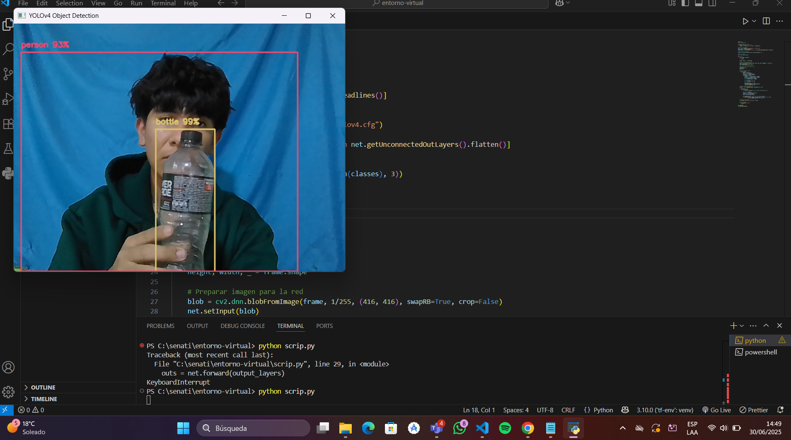

1.- Seguí todos los pasos del PDF al ejecutar mi archivo `scrip.py` en el visual, obtuve el siguiente error:

2025-06-29 10:24:59.005728: I tensorflow/core/util/port.cc:153] oneDNN custom operations are on. You may see slightly different numerical results due to floating-point round-off errors from different computation orders. To turn them off, set the environment variable `TF_ENABLE_ONEDNN_OPTS=0`.
2025-06-29 10:25:01.089650: I tensorflow/core/util/port.cc:153] oneDNN custom operations are on. You may see slightly different numerical results due to floating-point ro floating-point round-off errors from different computation orders. To turn them off, set the environment variable `TF_ENABLE_ONEDNN_OPTS=0`.           Traceback (most recent call last):                                                                                                                        File "C:\senati\entorno-virtual\scrip.py", line 12, in <module>                                                                                           bbox, label, conf = cv.detect_common_objects(frame)                                                                                                   File "C:\senati\entorno-virtual\tf-env\lib\site-packages\cvlib\object_detection.py", line 125, in detect_common_objects                                   net = cv2.dnn.readNet(weights_file_abs_path, config_file_abs_path)
cv2.error: OpenCV(4.11.0) D:\a\opencv-python\opencv-python\opencv\modules\dnn\src\darknet\darknet_io.cpp:705: error: (-215:Assertion failed) separator_index < line.size() in function 'cv::dnn::darknet::ReadDarknetFromCfgStream'

2.- y en la cual esto pregunte en la IA  para saber cual era el error y  me  dijo esto 

cv2.error: ... error: (-215:Assertion failed) separator_index < line.size() in function 'cv::dnn::darknet::ReadDarknetFromCfgStream'

significa que OpenCV no pudo leer correctamente el archivo de configuración (.cfg) del modelo YOLO y tenia que descargar los archivos de yolov4.cfg, yolov4.weights, coco.names

3.- La solucion que aplique fue descargar los archivos de yolo4 
yolov4.cfg: este archivo se descargaba como `.txt` desde el navegador, así que preguente si podia descargar  de otra forma y la solucion fue mediante curl

y el yolov4.weights si lo descargué directamente desde el navegador 

4. Modifiqué el código scrip.py para asegurarme de que los archivos estuvieran bien cargados y
después de esto el script funcionó perfectamente y detectó objetos en tiempo real y ahi paso las imagenes que detecto 

5.- Ahora que funcione en otro equipo clona y ejecuta los siguientes comandos despues de clonar 

python -m venv tf-env
.\tf-env\Scripts\activate
pip install -r requirements.txt

al final ejecutar 
python scrip.py

